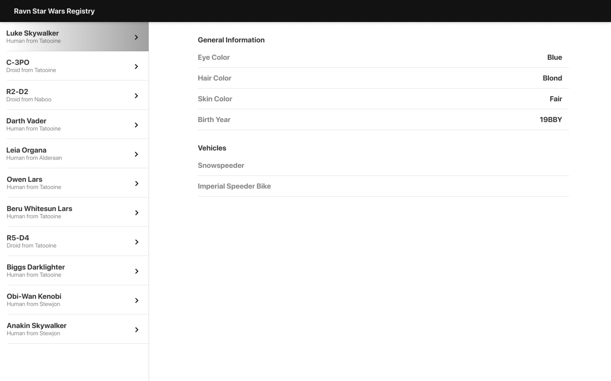

# Descripción del Proyecto
Aplicación web que permite la navegación por el API GraphQL Star Wars, para visualizar la información general de los personajes principales de la saga.

# Configuración / Ejecución

# Ovwerview

# Información Adicional

# Tecnologías utilizadas
- **GraphQL**
- **ApolloClient**
- **React**
- **React-Router**
- **Webpack**
- **Sass**
- **Firebase Hosting**