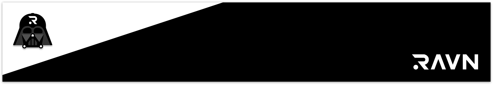
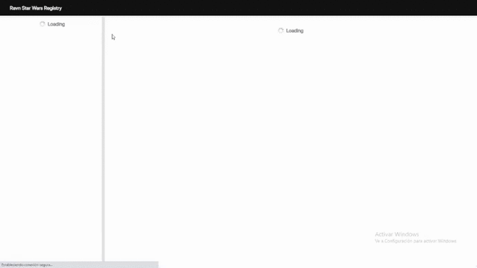
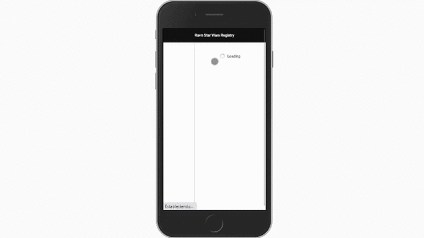
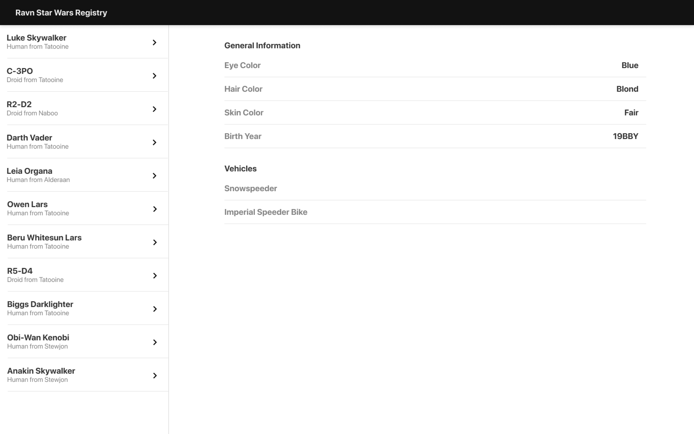
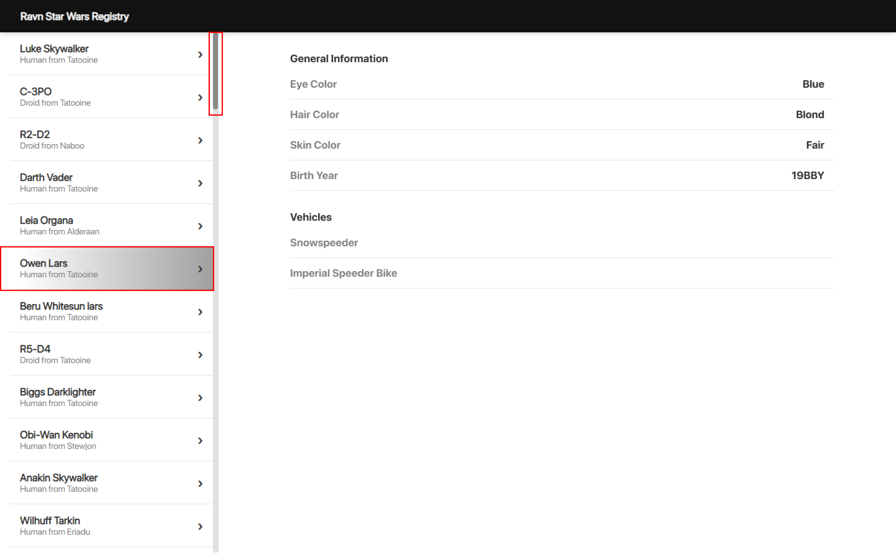

# RAVN GraphQL Code Challenge

## Descripción del Proyecto
Aplicación web que permite la navegación por el API GraphQL Star Wars, para visualizar la información general de los personajes principales de la saga.

## Configuración / Ejecución

**Building and running on localhost**

First install dependencies:

```sh
npm install
```

To create a production build:

```sh
npm run build-prod
```

To create a development build:

```sh
npm run build-dev
```

**Running**

Open the file `dist/index.html` in your browser


## Ovwerview



## Información Adicional

Luego de crear los 9 componentes de la aplicación trabajé en la vista home para renderizarlos de acuerdo a la respuesta del API, al ver casi lista la web decidí añadirle un estilo al item seleccionado para identificar con facilidad la informacion general del personaje que se visualiza del lado derecho. Por otro lado, en vista de que la cantidad de personajes que se mostraban en el componente Drawer sobrepasaban la pantalla, le añadí un scroll personalizado acorde con los estilos del prototipo para poder navegar por los items.

**Initial prototype**



**Prototype with variation**



## Tecnologías utilizadas
- **GraphQL**
- **ApolloClient**
- **React**
- **React-Router**
- **Webpack**
- **Sass**
- **Firebase Hosting**

**deployed application**
https://ravn-challenge-v2-argie-rincon.web.app/

```By: Argie Rincón```