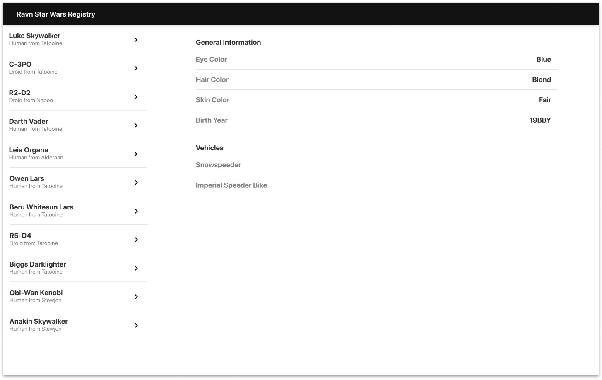
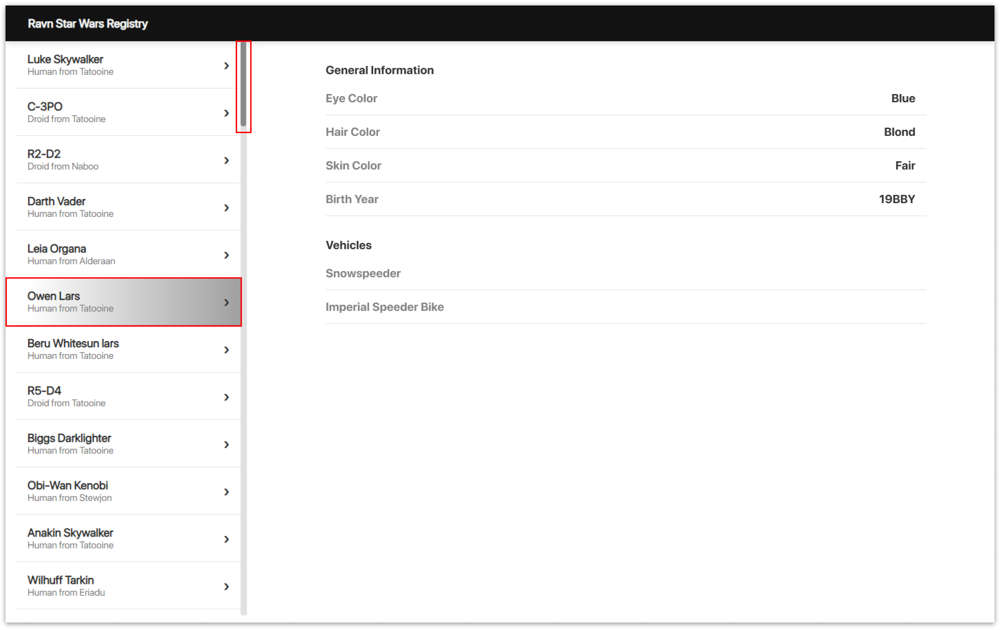

# RAVN GraphQL Code Challenge

## Project description

Those are a web application that allows navigation through the Star Wars GraphQL API to see general information about the main characters of the saga.

## Configuración / Ejecución

**Building and running on localhost**

First install dependencies:

```sh
npm install
```

To create a production build:

```sh
npm run build-prod
```

To create a development build:

```sh
npm run build-dev
```

**Running**

Open the file `dist/index.html` in your browser

## Application Ovwerview

**Web**


**Responsive**


## Additional Information

After creating the 9 components of the application, I worked in the home view to render them according to the API response. When I saw the web almost ready, I decided to add a style to the selected item to easily identify the general information of the character that is displayed from the right side. On the other hand, since the number of characters shown in the Drawer component exceeded the screen, I added a custom scroll according to the styles of the prototype to be able to navigate through the items.

**Initial prototype**



**Prototype with variation**



## Tecnologías utilizadas

- **GraphQL**
- **ApolloClient**
- **React**
- **React-Router**
- **Webpack**
- **Sass**
- **Firebase Hosting**

**deployed application**
https://ravn-challenge-v2-argie-rincon.web.app/

`By: Argie Rincón`
